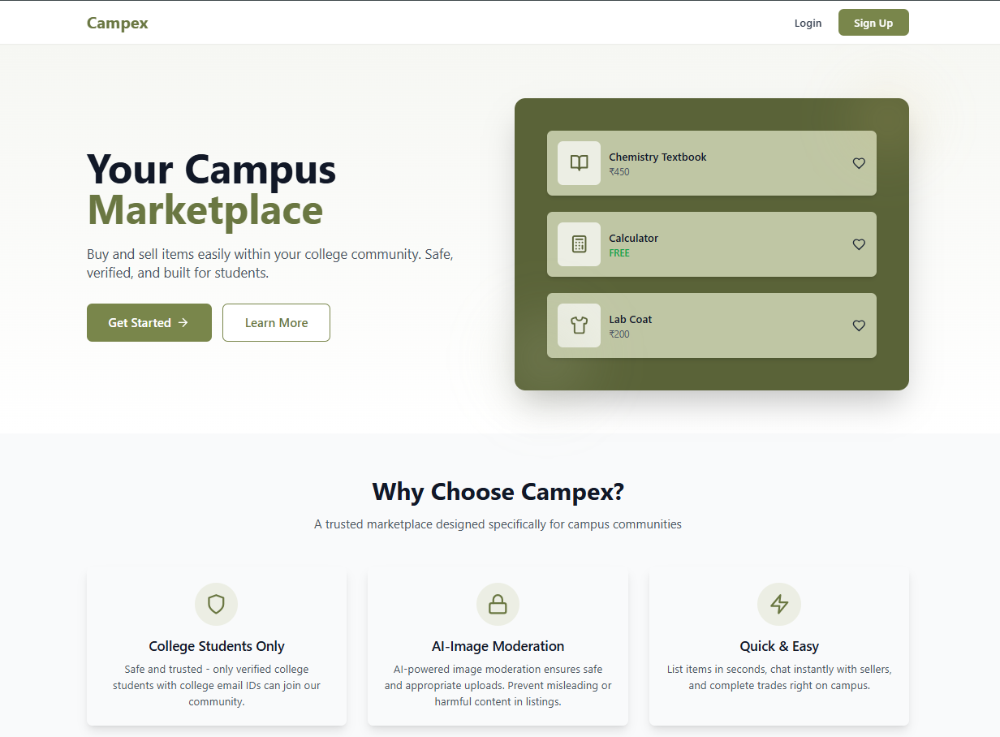
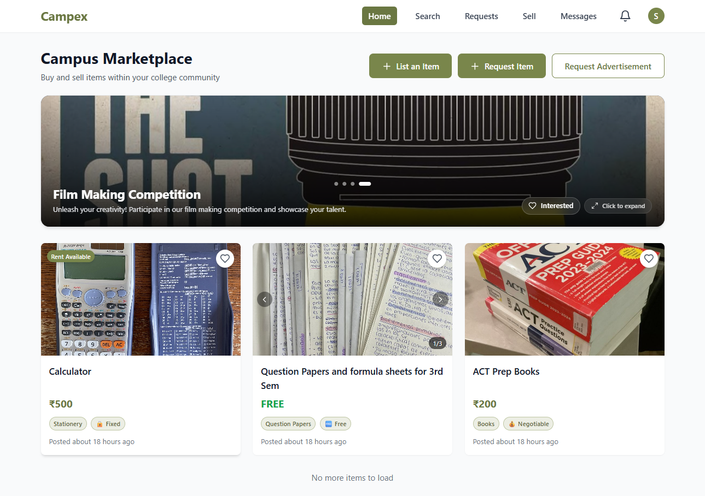
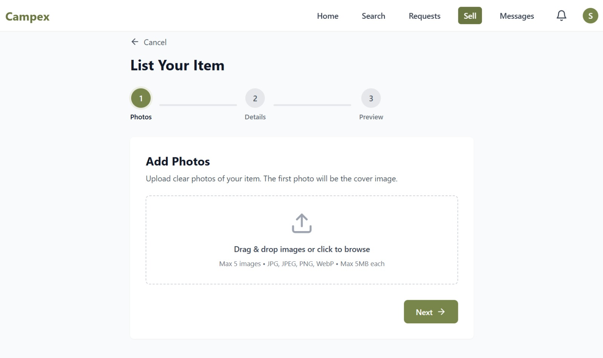

# 🎓 Campex - The Trusted Campus Marketplace


<div align="center">

  
  
  
  
  
  

</div>

<br />

**Campex** is a hyper-local, peer-to-peer marketplace built exclusively for university students. By restricting access to verified college email domains (e.g., `@ves.ac.in`), we solve the "stranger danger" problem of open marketplaces like OLX or Facebook, creating a safe space for students to trade textbooks, electronics, and supplies.

---

## 🧐 The Problem
Students struggle to buy and sell campus essentials. WhatsApp groups are spammy and unorganized, while open marketplaces are unsafe and full of irrelevant listings.

## 💡 The Solution
**Campex** provides a verified, organized, and AI-moderated platform where every user is confirmed to be from your university.

---

## ✨ Key Features

### 1. 🔐 Campus-Only Access
*   **Verified Students Only:** Access is strictly limited to students from the same university.
*   **Email Verification:** Access is granted through verified university email IDs (e.g., `@ves.ac.in`).
*   **Safe Marketplace:** Creates a safe and reliable campus marketplace by eliminating external risks.

### 2. 🛒 Item Listings
*   **Versatile Trading:** Students can list items to sell, give away, or rent.
*   **Rich Content:** Listings include uploaded images and detailed descriptions of the item.
*   **Categorized Layout:** Items are organized into categories like **Books**, **Question Papers**, **Electronics**, and others.
*   **Pricing Options:** Sellers can choose price tags like **Fixed Price**, **Negotiable**, **Free** or **Rent Available**.
*   **Report System:** Option for users to report inappropriate listings with reasons to maintain quality.

### 3. 🛡️ AI Image Moderation
*   **Secure Uploads:** AI-based image moderation ensures all uploaded content is safe.
*   **Explicit Content Blocker:** Prevents users from posting inappropriate, unsafe, or explicit images.

### 4. 🙋 Request Items
*   **Post Requests:** Students can put up a request for specific items they need.
*   **Smart Notifications:** Users get notified if someone requests an item they might have to lend or give out, facilitating a chat.

### 5. 💬 In-Platform Chat
*   **Direct Communication:** Chat with sellers directly through the platform to negotiate and discuss details.
*   **Meetup Coordination:** Decide on a safe meet-up place on campus.
*   **Block Feature:** Allows users to block a user if any inappropriate activity is noticed.

### 6. 📢 Advertisement Posters
*   **Campus Initiatives:** User can raise and post advertisement posters by sending a mail to us.
*   **Support Student Activities:** Supports campus and student initiatives, events, and announcements.

### 7. 🔔 Notifications
*   **Stay Informed:** In-app notifications for direct messages and item requests ensure you never miss an update.

---

## 🛠️ Technology Stack

| Domain | Technology | Use Case |
| :--- | :--- | :--- |
| **Frontend** | **React.js + Vite** | SPA Architecture, Fast HMR |
| **Styling** | **Tailwind CSS** | Custom "Olive & Gold" Design System |
| **State** | **React Query** | Server state management & caching |
| **Backend** | **Spring Boot (Java 17)** | RESTful API, Business Logic |
| **Database** | **PostgreSQL (Supabase)** | Relational Data Persistence |
| **Auth** | **Firebase Auth** | Identity Management & Token Verification |
| **Storage** | **Cloudinary** | Image Optimization & CDN |
| **AI** | **Google Cloud Vision** | Image Content Moderation |
| **Deployment** | **Vercel** (FE) / **Render** (BE) | CI/CD Hosting |

---

## 📸 Application Screenshots

| **Landing Page** | **Home Feed** | **Selling Wizard** |
|:---:|:---:|:---:|
|  |  |  |

---

## 🚀 Getting Started

Follow these instructions to set up the project locally.

### Prerequisites
*   Node.js (v18+)
*   Java JDK 17
*   Maven
*   PostgreSQL Database (Local or Supabase)

### 1. Clone the Repository
```bash
git clone https://github.com/sohanpal17/campex-project.git
cd campex-project
```

### 2. Backend Setup
Navigate to the backend folder:
```bash
cd campex-backend
```
Add your configuration files to `src/main/resources/`:
* `firebase-service-account.json`
* `google-credentials.json`

Configure `application.properties` with your database and API keys.

Run the server:
```bash
./mvnw spring-boot:run
```
Server runs on port 8080.

### 3. Frontend Setup
Navigate to the frontend folder:
```bash
cd campex-frontend
```

Install dependencies:
```bash
npm install
```

Create a `.env` file (see structure below).

Run the client:
```bash
npm run dev
```
Client runs on http://localhost:3000.

### 🔑 Environment Variables

#### Frontend (.env)
```env
VITE_API_BASE_URL=http://localhost:8080
VITE_FIREBASE_API_KEY=your_firebase_key
VITE_FIREBASE_AUTH_DOMAIN=your_project.firebaseapp.com
VITE_FIREBASE_PROJECT_ID=your_project_id
VITE_CLOUDINARY_CLOUD_NAME=your_cloud_name
VITE_CLOUDINARY_UPLOAD_PRESET=your_preset
VITE_COLLEGE_EMAIL_DOMAIN=@ves.ac.in
```

#### Backend (application.properties)
```properties
spring.datasource.url=jdbc:postgresql://host:5432/postgres
spring.datasource.username=postgres
spring.datasource.password=password
cloudinary.cloud-name=name
cloudinary.api-key=key
cloudinary.api-secret=secret
google.cloud.project-id=id
spring.mail.username=email@gmail.com
spring.mail.password=app_password
```

## ☁️ Deployment

### Frontend (Vercel)
1. Push code to GitHub.
2. Import project into Vercel.
3. Add Environment Variables in Vercel Dashboard.
4. Deploy.

### Backend (Render)
1. Create a Web Service on Render.
2. Connect GitHub repo.
3. Set Build Command: `./mvnw clean package`
4. Set Start Command: `java -jar target/backend-0.0.1-SNAPSHOT.jar`
5. Add Environment Variables (or upload secure files).

## 🤝 Contributing
Contributions are what make the open-source community such an amazing place to learn, inspire, and create. Any contributions you make are greatly appreciated.

1. Fork the Project
2. Create your Feature Branch (`git checkout -b feature/AmazingFeature`)
3. Commit your Changes (`git commit -m 'Add some AmazingFeature'`)
4. Push to the Branch (`git push origin feature/AmazingFeature`)
5. Open a Pull Request


<div align="center">
  <p><h3>Made by Savani and Sohan<h3></p>
</div>
